# 도로 돌발상황 분석

ITS 국가교통정보센터의 도로 돌발상황 데이터(62.3만 건, 2024-11 ~ 2025-10)를 분석해 돌발
유형·시간·도로별 발생 패턴을 찾고, 규칙 기반 스코어링으로 위험도를 정량화하는 프로젝트.

## 개요

국내 자동차 등록 대수는 2015년 약 2,099만 대에서 2024년 약 2,630만 대까지 매년 꾸준히
늘었다(국토교통부 시도별 자료 기준). 도로 위 교통량이 늘어난다는 것은 교통사고·공사·
차량고장 등 돌발상황이 발생할 여지도 함께 늘어난다는 뜻이고, 이는 곧 혼잡·지체·안전사고
위험 증가로 이어져 도로를 이용하는 사람들의 일상에 영향을 준다. 이 프로젝트는 돌발상황
데이터 자체를 뜯어봐서 (1) 발생 패턴을 찾고 (2) 어떤 상황이 실제로 더 위험한지 정량화하고
(3) 교통운영에 참고할 시사점을 도출하는 것을 목표로 한다.

| 핵심 결과 | 수치 |
|---|---|
| 데이터 규모 | 원본 API 수집 636,320건 → 전처리 후 623,188건 |
| 가장 많이 발생하는 유형 | 작업 191,487건 (30.7%) |
| 건당 위험도가 가장 높은 유형 | 사고 (평균 61.1점 / 100점) |
| 위험기여도(빈도×평균위험도) 1위 | 작업 (약 901.8만) — 근소하게 사고(약 880.9만)를 앞섬 |
| 돌발 1위 지역 | 경기도 163,402건 (26.2%) |
| 데이터 품질 이슈 발견 | 처리 완료 건의 59.3%가 정확히 30분으로 기록 — 시스템 기본값 의심 |

## 데이터

- 출처: [ITS 국가교통정보센터](https://www.its.go.kr) 오픈데이터 API (돌발정보)
- 수집기간: 2024-11-01 ~ 2025-10-31 (1년, API 수집 기준)
- 규모: 원본 636,320건 → 전처리 후 **623,188행 × 15개 컬럼**
- 원본 파일과 저장소 포함 방식은 [data/README.md](data/README.md) 참고 (gzip 압축 전체
  데이터 포함, 클론만 하면 실행 가능)

### 컬럼 스키마

| 컬럼 | dtype | 결측치 | 설명 |
|---|---|---|---|
| 돌발일시 | object | 0 | 돌발상황 발생 일시 |
| 관리기관 | object | 0 | 도로 관리 기관 |
| 도로타입 | object | 0 | 고속국도/일반국도/도시고속국도 등 도로 분류 |
| 도로번호 | float64 | 698 | 노선 번호 (결측 691건은 `도로타입`이 `-`인 행) |
| 도로명 | object | 0 | 노선명 |
| 방향 | object | 87,665 | 진행 방향(기점/종점 등) |
| 돌발구분 | object | 0 | 대분류(기상/공사/교통사고/재난/기타돌발/기타) |
| 돌발상세구분 | object | 0 | 소분류(추돌/차단/작업 등) |
| 돌발내용 | object | 14,291 | 자유 텍스트 상세 내용(위치·차로 정보 포함) |
| X | float64 | 0 | 경도 |
| Y | float64 | 0 | 위도 |
| 링크아이디 | object | 0 | 도로 링크 ID (`-` 8,526건 포함) |
| 돌발종료일시 | object | 0 | 종료 일시 (진행중 시 `-`, 366,098건) |
| 요일 | object | 0 | 사건 발생 요일 |
| 요일구분 | object | 0 | 평일/주말/공휴일 구분 |

### 원본 보고서 대비 데이터 수치 차이

| 항목 | 원본 보고서 | 이번 재현 결과 |
|---|---|---|
| 원본 API 수집 건수 | 636,320건 | 636,320건 (동일) |
| 최종 전처리 건수 | 623,188건 (대시보드 표기 기준) | 623,188건 (동일) |
| 돌발상세구분 Top1(작업) | 196,339건 | 191,487건 |
| 돌발구분 대분류 합계 | 634,671건 (2.2.1절 차트 합) | 623,188건 |
| 도로번호 결측치 | 1,323건 | 698건 (그중 691건은 `도로타입`이 `-`) |

돌발상세구분·돌발구분 세부 건수가 원본과 정확히 일치하지 않는 이유는 뒤 [원본 보고서와의
차이점](#원본-보고서와의-차이점)에서 다룬다.

## EDA

`01_eda.ipynb`에서 데이터 구조, 결측치, 기간, 기본 분포를 확인한다. 별도 차트는 생성하지
않는다(02번 노트북에서 시각화).

**돌발구분 분포**

| 돌발구분 | 건수 | 비율 |
|---|---|---|
| 기타돌발 | 212,606 | 34.1% |
| 공사 | 201,333 | 32.3% |
| 교통사고 | 146,227 | 23.5% |
| 기상 | 37,702 | 6.0% |
| 재난 | 13,009 | 2.1% |
| 기타 | 12,311 | 2.0% |

**돌발상세구분 Top 10**

| 돌발상세구분 | 건수 | 비율 |
|---|---|---|
| 작업 | 191,487 | 30.7% |
| 사고 | 144,066 | 23.1% |
| 차량증가/정체 | 103,248 | 16.6% |
| 고장 | 86,529 | 13.9% |
| 강우 | 27,203 | 4.4% |
| 장애물 | 19,950 | 3.2% |
| 시설물보수작업 | 9,705 | 1.6% |
| 기상 | 6,320 | 1.0% |
| 적설 | 6,182 | 1.0% |
| 안개 | 4,118 | 0.7% |

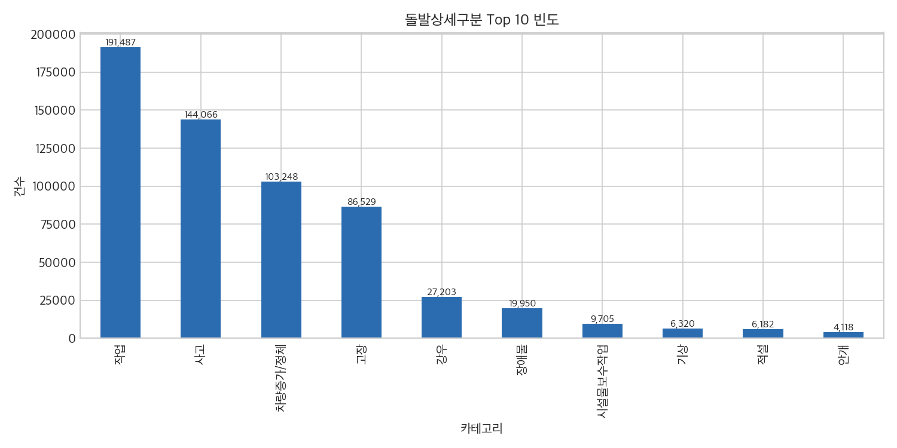

**도로타입 분포**

| 도로타입 | 건수 | 비율 |
|---|---|---|
| 고속국도 | 483,758 | 77.6% |
| 특별광역시도 | 43,892 | 7.0% |
| 일반국도 | 39,729 | 6.4% |
| 도시고속국도 | 23,598 | 3.8% |
| 시군도 | 23,466 | 3.8% |
| 지방도 | 5,183 | 0.8% |
| 국가지원지방도 | 2,702 | 0.4% |
| `-` (미상) | 860 | 0.1% |

## 피처 엔지니어링

원본 CSV에는 없는 파생변수를 `src/load_data.py`, `src/region_mapping.py`에서 생성한다.
`요일`/`요일구분`은 원본 팀의 전처리 단계에서 이미 만들어져 raw CSV에 포함돼 있다.

| 변수명 | 생성 로직 | 목적/활용처 | 생성 위치 |
|---|---|---|---|
| `hour` | `돌발일시.dt.hour` | 시간대별 패턴(02, 04, 06번 노트북) | `load()` 호출 시점 |
| `month` | `돌발일시.dt.month` | 월별 트렌드(02번) | 〃 |
| `season` | `month` → 봄(3-5)/여름(6-8)/가을(9-11)/겨울(12-2) 매핑 | 계절별 분석(02번) | 〃 |
| `지역` | 위경도(X, Y) → `geopandas`로 17개 시/도 행정경계와 point-in-polygon 매칭, 실패 시(약 0.3%) 최근접 시/도로 대체 | 지역별 분석(03번) | `region_mapping.assign_region()` |
| `요일` | `돌발일시` 기준 영문 요일 | 요일별 패턴(02번) | 원본 전처리(raw CSV에 이미 포함) |
| `요일구분` | `요일` → 평일/주말/공휴일 분류 | 평일-주말 비교(02번) | 원본 전처리(raw CSV에 이미 포함) |

### 지역 매핑 방법론

`지역` 컬럼은 원본 데이터에 없어 위경도로부터 새로 만들어야 하는 파생 변수다. 두 가지
방식을 시도했다.

1. **(이전 버전) 최근접 중심점 근사**: 17개 시/도의 대표 좌표(위경도 1쌍)와의 유클리드
   거리만으로 가장 가까운 시/도를 배정. 구현이 간단하지만 서울처럼 면적이 작고 주변이
   경기도로 둘러싸인 지역은 실제로는 경기도 행정구역에 속한 좌표까지 서울로 잘못
   배정하는 문제가 있었다 — 이 방식으로는 전체 1위가 (원본 보고서와 다르게) 서울로
   나왔다.
2. **(현재 버전) geopandas point-in-polygon**: 통계청 SGIS 2018년 시/도 경계
   ([southkorea/southkorea-maps](https://github.com/southkorea/southkorea-maps) GeoJSON,
   `data/boundaries/`, 저장소 용량을 위해 simplify tolerance 0.0005도로 단순화)에 대해
   실제 폴리곤 포함 여부를 검사한다. 경계 밖으로 판정되는 좌표(해상/GPS 오차, 약 0.3%)는
   `sjoin_nearest`로 최근접 시/도에 배정한다.

방식을 바꾼 뒤 전체 1위가 원본 보고서와 동일하게 **경기도**로 나왔다(2위 이하는 다르며,
[원본 보고서와의 차이점](#원본-보고서와의-차이점) 참고).

## 패턴 분석

### 요일·시간대·계절별 패턴 (02번 노트북)

**월별 Top 카테고리 최댓값**

| 돌발상세구분 | 최댓값 발생 월 | 건수 | 추세 |
|---|---|---|---|
| 작업 | 9월 | 28,437건 | 1월 최저(7,997건) → 9월까지 증가 → 10월부터 감소 |
| 사고 | 7월 | 18,814건 | 11~4월 낮은 수준 유지 → 5월부터 급증 |
| 차량증가/정체 | 10월 | 12,448건 | 1~9월 비슷한 수준 → 10월에 최댓값 |

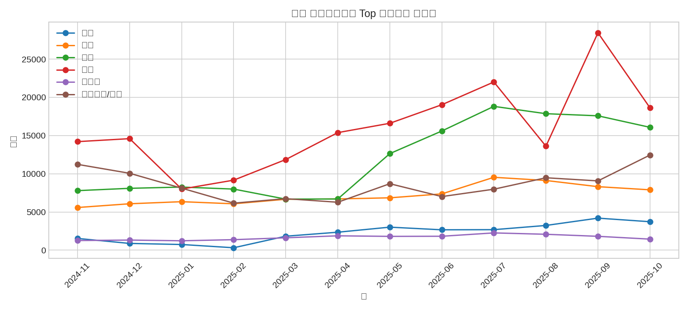

**평일 vs 주말**

| 구분 | 건수 | 비율 |
|---|---|---|
| 평일 | 471,631 | 75.7% |
| 주말 | 125,986 | 20.2% |
| 공휴일 | 25,571 | 4.1% |

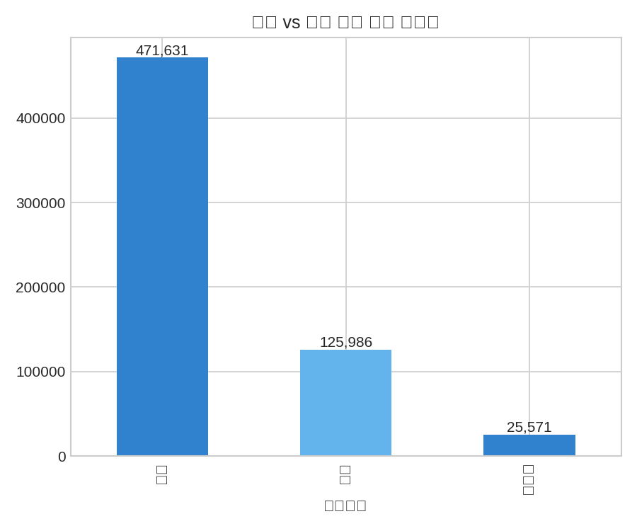

**작업의 요일별 비중** (계획된 공사 위주라 평일에 집중)

| 요일 | 목 | 월 | 화 | 수 | 금 | 토 | 일 |
|---|---|---|---|---|---|---|---|
| 비중 | 20.0% | 19.9% | 19.6% | 19.0% | 13.4% | 4.6% | 3.5% |

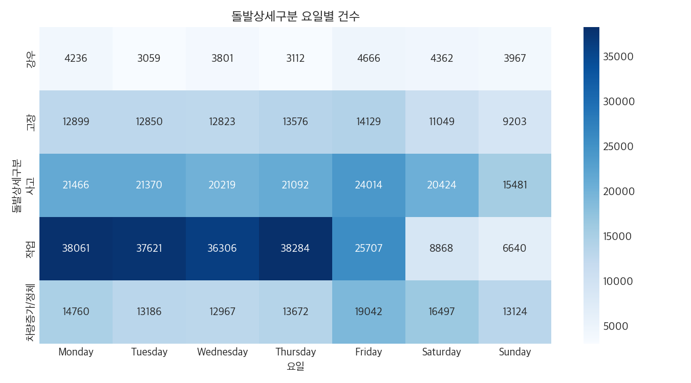

**시간대 피크**

| 구분 | 피크 시간대 | 건수 |
|---|---|---|
| 평일 | 09시 | 52,157건 |
| 주말 | 14시 | 11,727건 |

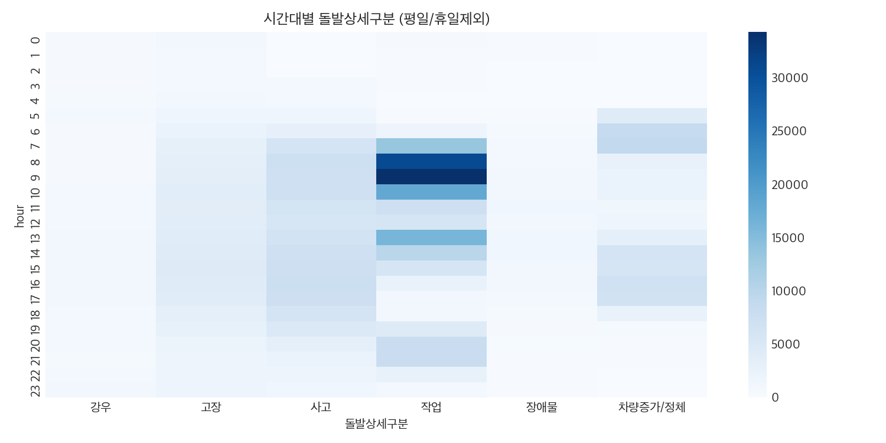
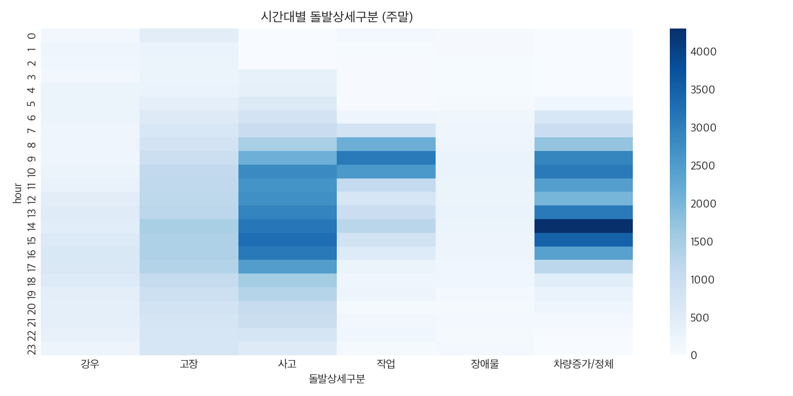

**계절별 발생 건수 및 교통사고 비율**

| 계절 | 전체 발생 건수 | 비율 | 사고 건수 | 전체 대비 사고 비율 |
|---|---|---|---|---|
| 봄 | 137,185 | 22.0% | 26,014 | 19.0% |
| 여름 | 182,764 | 29.3% | 52,262 | 28.6% |
| 가을 | 183,921 | 29.5% | 41,442 | 22.5% |
| 겨울 | 119,318 | 19.1% | 24,348 | 20.4% |

발생 건수는 가을이 근소하게 가장 많지만(29.5%), 전체 대비 사고 "비율"은 여름이
가장 높다(28.6%) — 건수가 몰리는 계절과 사고 위험이 몰리는 계절이 다르다.

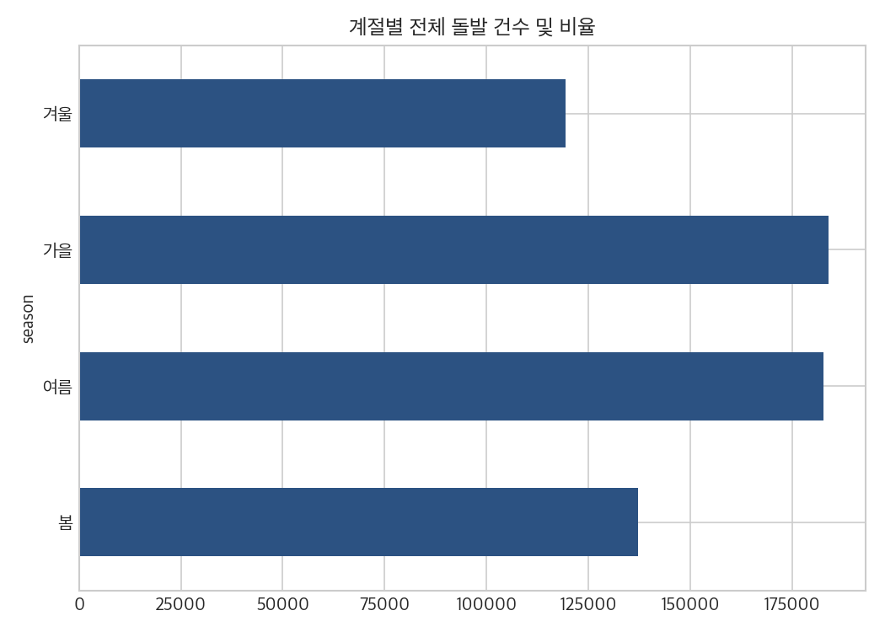

### 도로타입·도로번호·지역별 패턴 (03번 노트북)

**도로타입별 돌발구분 구성비 (%)**

| 도로타입 | 공사 | 교통사고 | 기상 | 기타 | 기타돌발 | 재난 |
|---|---|---|---|---|---|---|
| 고속국도 | 25.2 | 20.0 | 7.5 | 1.2 | 43.4 | 2.7 |
| 국가지원지방도 | 62.3 | 29.7 | 0.6 | 7.4 | 0.0 | 0.0 |
| 도시고속국도 | 22.7 | 76.0 | 0.6 | 0.7 | 0.0 | 0.0 |
| 시군도 | 76.4 | 17.7 | 1.2 | 4.7 | 0.0 | 0.0 |
| 일반국도 | 63.9 | 25.8 | 0.8 | 2.8 | 6.4 | 0.2 |
| 지방도 | 75.1 | 19.8 | 3.5 | 1.6 | 0.0 | 0.0 |
| 특별광역시도 | 56.0 | 34.4 | 0.7 | 8.8 | 0.0 | 0.0 |

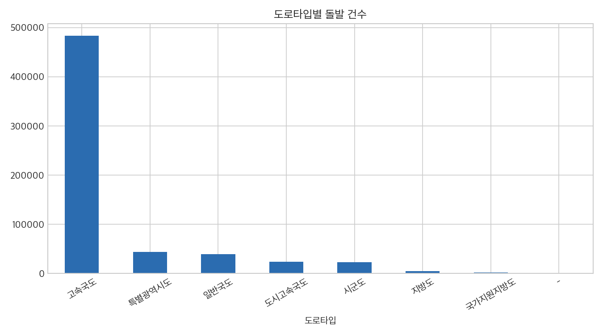
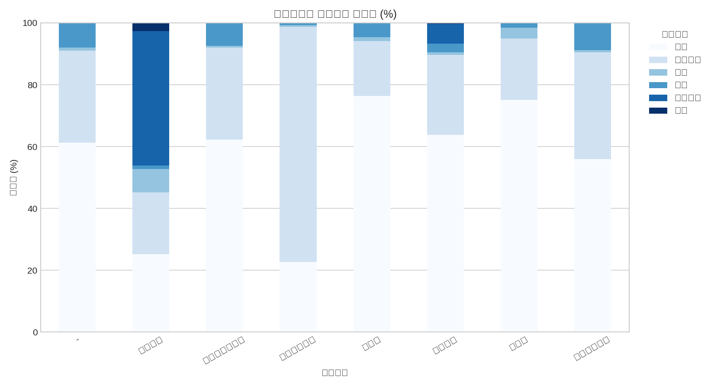

**도로번호별 비중 Top 6**

| 도로번호 | 비중 |
|---|---|
| 0번 (다수 일반도로 통합) | 11.9% |
| 1번 (경부고속도로) | 11.3% |
| 50번 | 7.1% |
| 100번 | 6.9% |
| 15번 | 6.9% |
| 35번 | 6.1% |

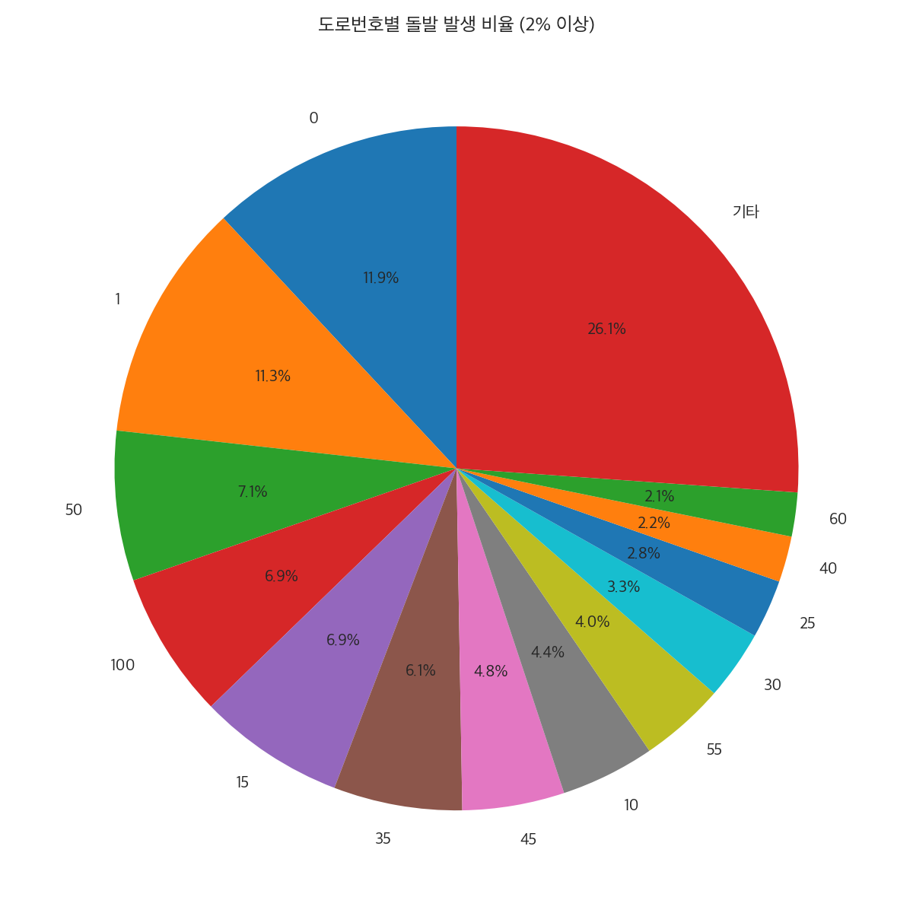

**시/도별 돌발 건수 Top 5**

| 시/도 | 건수 | 비율 |
|---|---|---|
| 경기도 | 163,402 | 26.2% |
| 경상남도 | 58,531 | 9.4% |
| 경상북도 | 52,466 | 8.4% |
| 서울특별시 | 47,366 | 7.6% |
| 충청북도 | 45,833 | 7.4% |

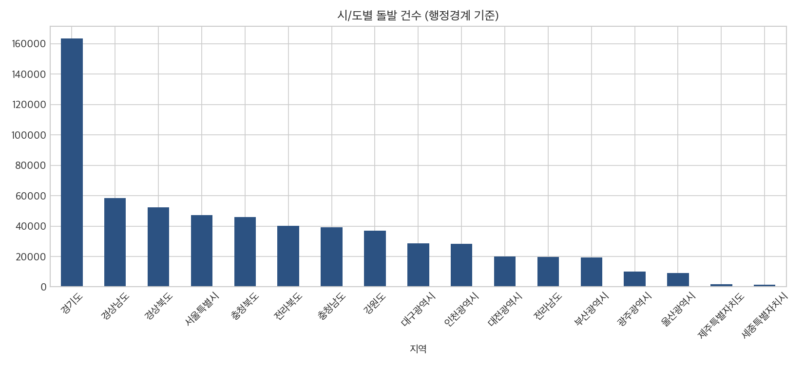

**시/도별 Top1 돌발유형**: 서울특별시만 유일하게 교통사고가 1위이고, 나머지 지역은
대체로 공사 또는 기타돌발(정체/고장류)이 1위다(03번 노트북 표 참고).

### 도로타입 × 도로번호 딥다이브 (05번 노트북)

도로타입 평균만으로는 가려지는, 같은 도로타입 안에서 유독 패턴이 다른 도로를 도로타입별
상위 20개(도로번호 또는 도로명, `특별광역시도`·`시군도`는 도로번호가 항상 0이라 도로명
대체) 단위로 확인했다.

| 도로타입 | 예외 도로 | 최다비중 돌발구분 | 해당 도로 비중 | 도로타입 평균 |
|---|---|---|---|---|
| 고속국도 | 27번 | 공사 | 31.9% | 25.2% |
| 특별광역시도 | 세종대로 | 기타 | 76.8% | 8.8% |
| 일반국도 | 47번 | 교통사고 | 59.6% | 25.8% |
| 도시고속국도 | 112번 | 공사 | 85.1% | 22.7% |
| 시군도 | 구암대로 | 공사 | 61.7% | 76.4% |
| 지방도 | 1020번 | 교통사고 | 73.3% | 19.8% |
| 국가지원지방도 | 58번 | 교통사고 | 61.9% | 29.7% |

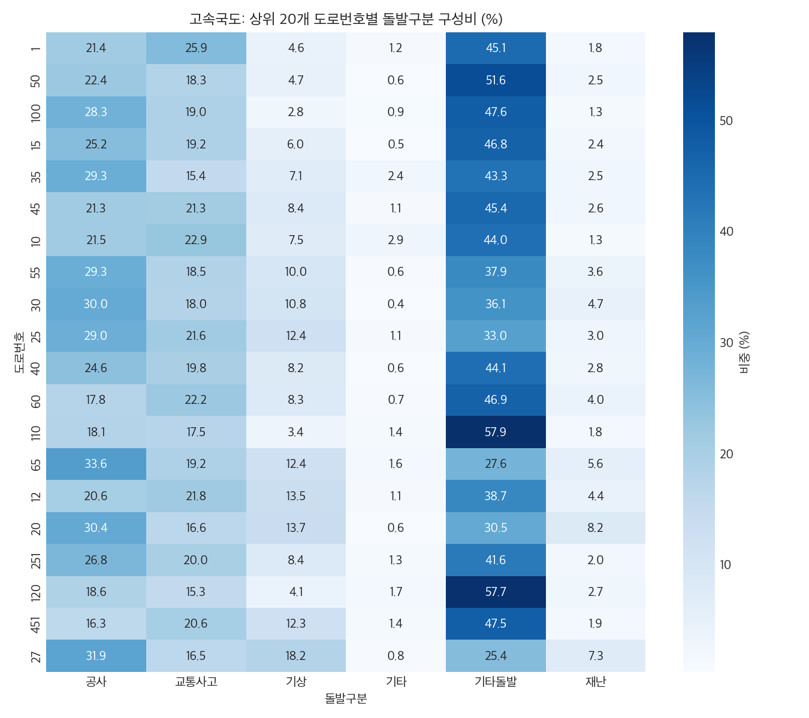
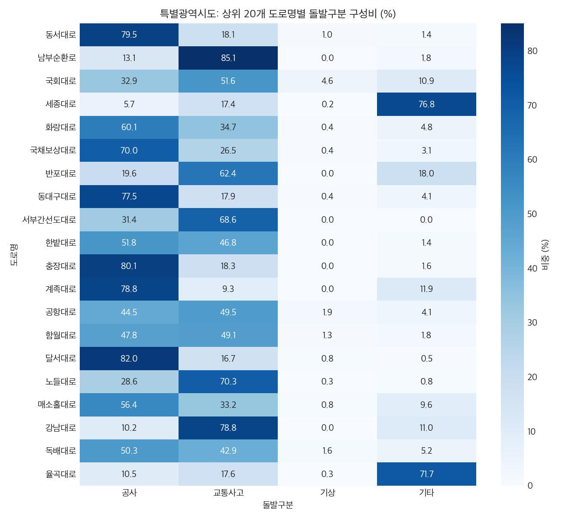
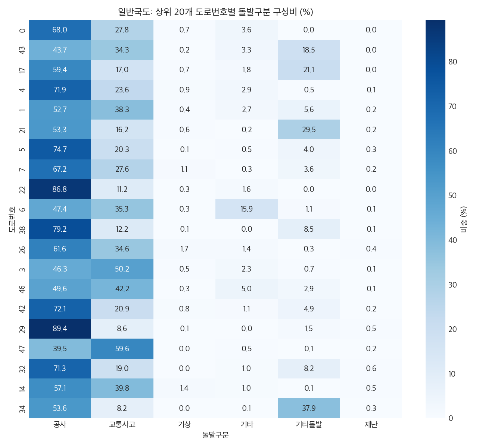
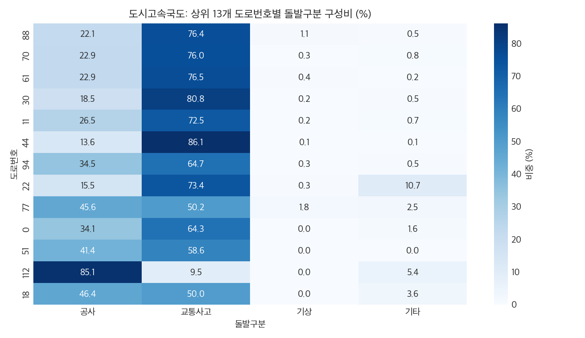
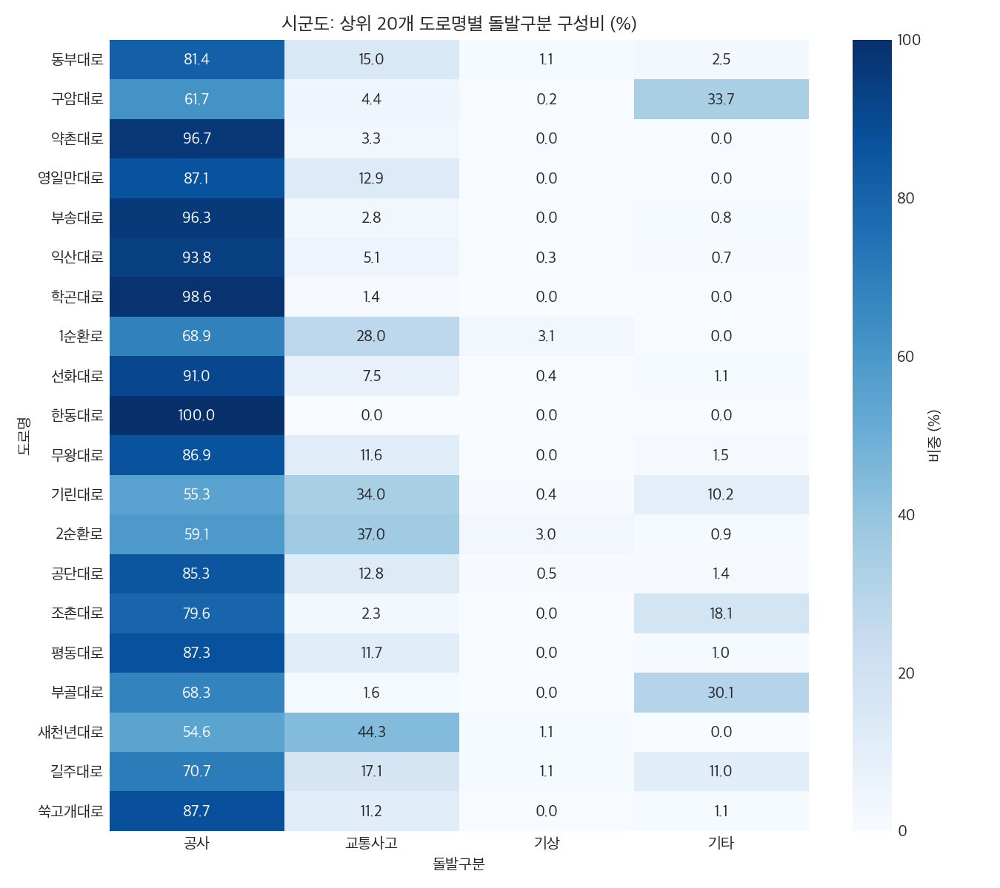
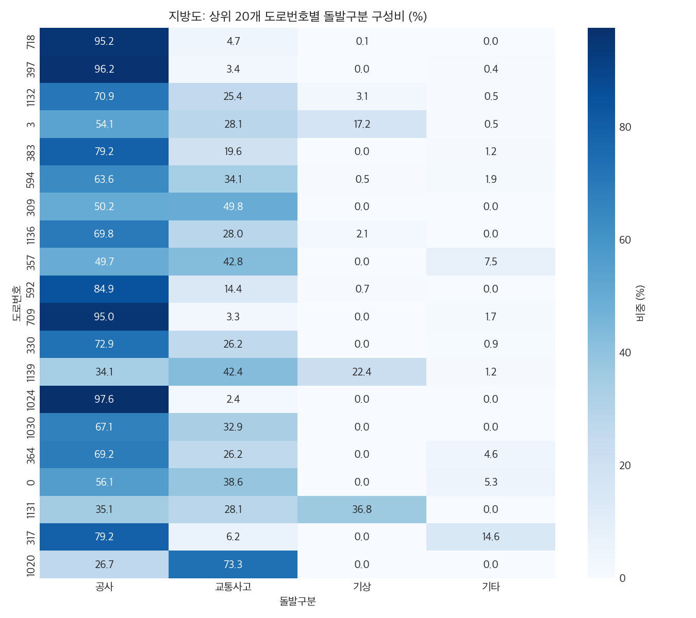
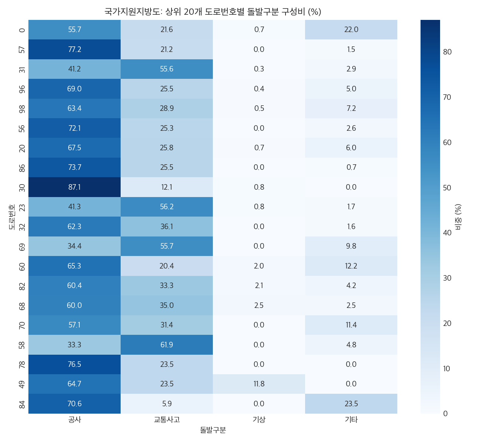

### 돌발상황 처리시간 분석 (06번 노트북)

`돌발종료일시 - 돌발일시`로 처리시간(분)을 계산한다(진행중 건·데이터 오류 제외, 총
257,038건).

| 도로타입 | 건수 | 평균(분) | 중앙값(분) | Q1 | Q3 |
|---|---|---|---|---|---|
| 고속국도 | 119,052 | 80.1 | 30.0 | 30.0 | 30.0 |
| 국가지원지방도 | 2,702 | 141.6 | 30.0 | 30.0 | 30.0 |
| 시군도 | 23,466 | 122.0 | 30.0 | 30.0 | 30.0 |
| 지방도 | 5,183 | 493.4 | 30.0 | 30.0 | 30.0 |
| 특별광역시도 | 43,892 | 330.6 | 30.0 | 30.0 | 104.2 |
| 일반국도 | 38,285 | 272.0 | 30.0 | 30.0 | 300.0 |
| 도시고속국도 | 23,598 | 1,524.8 | 30.0 | 30.0 | 30.0 |

**중요한 발견 — 30분 스파이크**: 모든 도로타입에서 중앙값이 정확히 30분이고, 처리
완료 건의 **59.3%(152,388건)가 정확히 30분**으로 기록돼 있다. 실제 현장 처리시간이
우연히 정확히 30분에 몰릴 이유는 없으므로, 이는 실측값이 아니라 **종료시각 미입력 시
시스템이 채워 넣는 기본값일 가능성이 높다**. 또한 `공사` 카테고리는 `돌발종료일시`가
실제 종료가 아니라 수개월~수년 뒤의 공사 예정 종료일로 기록된 경우가 있어(최대 약
2.7년) 평균값이 극단치에 크게 좌우된다 — 그래서 도로타입 비교는 평균이 아닌 중앙값·
Q1·Q3를 기준으로 해석한다.

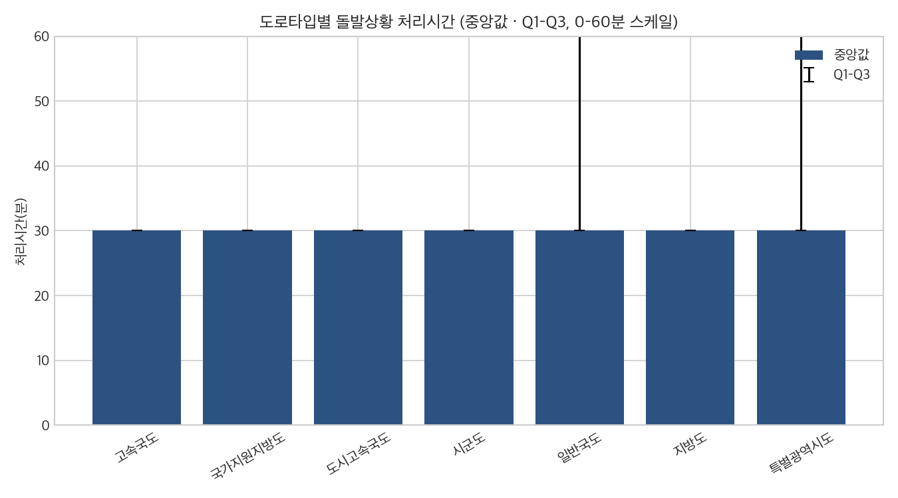
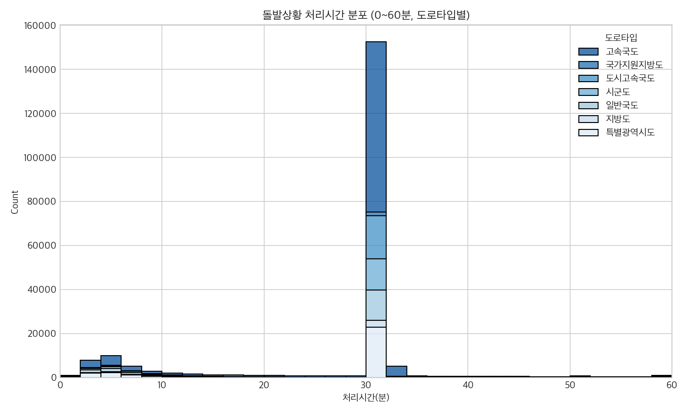

## 위험도 스코어링(규칙기반)

각 돌발 레코드에 위치·돌발유형·차로통제·시간대 4개 항목을 정규식/키워드 기반으로 채점해
0~100점의 `risk_score`를 산출한다(원본 보고서 2.1.2절 기준표를 그대로 재현).

### 스코어링 기준표

| 항목 | 점수범위 | 세부 기준 | 근거 |
|---|---|---|---|
| 위치 | 0~20 | 터널 20 / 교량·대교·~교 15 / IC·JC·JCT·분기 10 / 고속도로 8 / 일반도로 3(옵션) / 정보없음 0 | 시야 제한·회피 어려움일수록 사고 시 위험 ↑ |
| 돌발유형 | 0~25 | 사고 25 / 고장 15 / 공사·작업·시설점검 10 / 정체·지체·서행 5 / 기상 3 / 기타 0 | 급정거·2차사고 가능성이 클수록 영향도 ↑ |
| 차로통제 | 0~40 | 전체차로차단/전면통제 40 / 2개 이상 차로차단 30 / 1개 차로차단 20 / 갓길정차·고장 10 / 정보없음 0 | 차단 범위가 넓을수록 정체 파급 ↑ |
| 시간대 | 0~15 | 출근 7-9시·퇴근 17-19시 15 / 주간 10-16시 10 / 야간·심야 5 / 정보없음 0 | 동일 돌발이라도 혼잡 시간대일수록 영향 ↑ |

전체 `risk_score` 분포: 평균 43.2점, 중앙값 43점, 표준편차 15.9점 (최소 8점, 최대 100점).

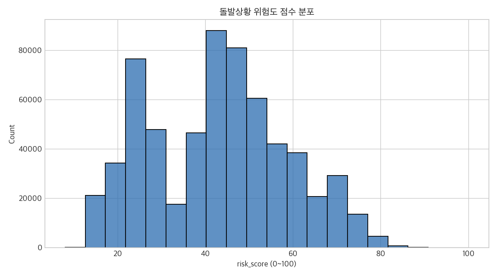

### 카테고리별 평균 위험도 (빈도 30건 이상, 상위 5개)

| 돌발상세구분 | 빈도 | 평균 위험도 |
|---|---|---|
| 사고 | 144,066 | 61.1 |
| 역주행 | 319 | 55.2 |
| 화재사고 | 39 | 50.7 |
| 작업 | 191,487 | 47.1 |
| 고장 | 86,529 | 45.2 |

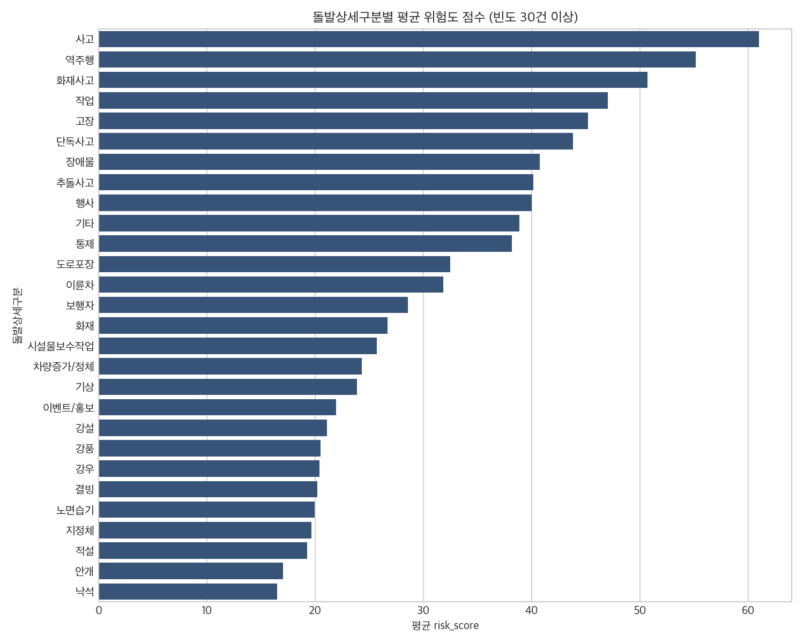

### 위험기여도(빈도 × 평균위험도) Top 5

| 순위 | 돌발상세구분 | 빈도 | 평균 위험도 | 위험기여도 |
|---|---|---|---|---|
| 1 | 작업 | 191,487 | 47.0 | 약 901.8만 |
| 2 | 사고 | 144,066 | 61.0 | 약 880.9만 |
| 3 | 고장 | 86,529 | 45.0 | 약 391.1만 |
| 4 | 차량증가/정체 | 103,248 | 24.0 | 약 251.0만 |
| 5 | 장애물 | 19,950 | 41.0 | 약 81.3만 |

사고는 건당 위험도가 가장 높지만, 건수가 압도적으로 많은 작업이 총 위험기여도로는
근소하게 앞선다.

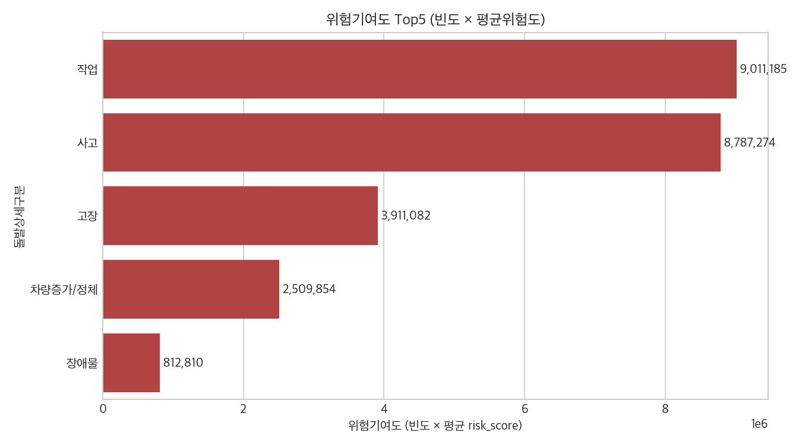

## 결과 활용

원본 보고서 4장 "교통운영 전략 제안"의 제안 내용을 요약한다(제안 자체는 원본 팀의
결과물이며, 우리 재현 결과와 연결되는 부분은 괄호로 표시).

| 구분 | 제안 내용 |
|---|---|
| 도로타입별 전략 | 고속국도: 평일 출퇴근·주말 주간 시간대 차량정체·고장 대응 우선(→ 기타돌발 비중 43.4%와 일치). 도시고속국도: 사고 비율이 가장 높은 퇴근 시간대(17~19시)를 사고 예방 집중관리 시간대로 지정(→ 교통사고 비중 76.0%와 일치). 국가지원지방도: 공사 비중이 높은 특성(→ 62.3%)을 고려해 주간 공사를 야간으로 분산 |
| 노선별 맞춤 전략 | 35번·100번(고속국도): 노후 도로·우회로 부족으로 공사 시 즉각 통제 필요(→ 재현 결과 공사 비중 29.3%/28.3%로 도로타입 평균 25.2%보다 높음, 확인됨). 70번·88번(도시고속국도): 교통량이 많고 급차선 변경 구간이 많아 사고가 잦음(→ 교통사고 비중 76.0%/76.4%로 도로타입 평균과 거의 동일 — [차이점](#원본-보고서와의-차이점) 참고) |
| 시간대별 전략 | 오전(06~12시): 전체 돌발이 가장 많아 순찰·초기대응 인력 집중배치. 퇴근(18~19시): 사고 비율이 최고조라 사고예방 중심 감속유도·현장대응 강화(→ 계절 불문 사고 비율이 여름에 가장 높다는 결과와 함께 고려할 부분) |
| 계절별 전략 | 계절별 출근 시간 신규 공사 제한, 네비게이션·기상 시스템 연동한 속도조절·우회 안내 강화 |
| 돌발 유형별 전략 | 작업: 반복 공사를 통합 유지보수로 묶어 횟수 축소, 사전 안내로 분산 유도. 사고: 기상·시간·요일 기반 AI 위험도 예측 도입(→ 이 프로젝트의 위험도 스코어링이 그 초기 버전에 해당). 정체: 스마트 차선 관리. 고장·장애물: 객체 인식 CCTV로 빠른 탐지 후 전담 신속대응팀 편성 |

## 종합 인사이트

원본 보고서 3장의 인사이트를 이번 코드 실행 결과 기준 수치로 재구성했다.

- **작업과 사고가 가장 영향력이 큰 두 축이다.** 작업은 건수(191,487건, 30.7%)로, 사고는
  건당 위험도(평균 61.1점)로 각각 다른 방식의 "가장 중요한 카테고리"다. 위험기여도(빈도
  × 영향도) 기준으로는 작업(약 901.8만) > 사고(약 880.9만) 순으로 근소하게 갈린다.
- **도로타입이 돌발 패턴을 가르는 가장 강한 설명 변수다.** 국가지원지방도(공사 62.3%),
  도시고속국도(교통사고 76.0%), 고속국도(기타돌발 43.4%)처럼 도로타입마다 지배적인
  돌발구분이 뚜렷이 다르고, 지역별 Top1 유형도 지역 고유의 특성보다는 그 지역에 어떤
  도로타입이 많이 지나는지에 좌우된다(서울만 유일하게 교통사고 1위).
- **같은 도로타입 안에서도 편차가 크다.** 도시고속국도 112번(공사 85.1%), 지방도 1020번
  (교통사고 73.3%)처럼 도로타입 평균과 크게 다른 예외 노선이 존재해, 전략을 짤 때는
  도로타입 단위뿐 아니라 개별 노선 단위 점검이 필요하다.
- **시간·요일·계절 모두 뚜렷한 리듬이 있다.** 평일 오전 9시(출근), 목~월요일(공사),
  여름철(사고 비율)처럼 돌발 유형별로 "언제 집중되는지"가 서로 다르므로, 유형별로 시점을
  겨냥한 대응이 더 효율적일 것으로 보인다.
- **기록 데이터 자체의 한계도 발견했다.** 처리시간의 59.3%가 정확히 30분으로 찍혀 있는
  것은 실제 현장 대응 속도가 아니라 시스템 기본값일 가능성이 높아, 이 데이터만으로 "실제
  도로타입별 대응 속도"를 판단하기는 어렵다.

## 원본 보고서와의 차이점

| 항목 | 원본 보고서 | 이번 재현 결과 | 추정 원인 |
|---|---|---|---|
| 지역 랭킹(2위 이하) | 경기도 → 서울특별시 → 충청북도 | 경기도 → 경상남도 → 경상북도 → 서울특별시 → 충청북도 | 원본은 지역 구분 알고리즘을 상세히 밝히지 않음. 고속국도가 전체의 78%이고 물리적으로 서울보다 훨씬 넓은 경기·경상권에 걸쳐 있어, 실제 행정경계(point-in-polygon) 기준으로는 서울 비중이 낮아지는 편이 지리적으로 타당 |
| 돌발상세구분 Top1(작업) 건수 | 196,339건 | 191,487건 | 전처리 스냅샷 차이로 추정(아래 항목과 함께) |
| 돌발구분 대분류 합계 | 634,671건(2.2.1절 차트) vs 623,188건(대시보드) — 원본 문서 내에서도 챕터별 합계가 다름 | 623,188건(대시보드 수치와 일치) | 원본 팀의 전처리 파이프라인이 여러 단계로 나뉘어 있어, 챕터마다 서로 다른 정제 시점의 스냅샷을 사용한 것으로 추정 |
| 도로번호 결측치 | 1,323건 | 698건 | 위와 동일한 스냅샷 차이 추정 |
| 위험도 평균(사고 카테고리) | 60.7점 | 61.1점 | 근소한 차이, 스냅샷 차이 범위 내 |
| 데이터 수집 기간 표기 | 2024.11.01~2025.10.31 (설계 기준) | 실제 최초 기록 2024-11-06 (수집 기간 밖 값 326건 제거 후) | 정제 과정에서 기간 외 값 제거 |
| 70·88번(도시고속국도) 공사 비중 | "교통사고 비중이 높은 도시고속국도 도로타입과 다르게 공사의 비중이 높게 나왔다"(4장) | 공사 22.9%/22.1%로 도로타입 평균(22.7%)과 거의 동일, 교통사고가 여전히 76.0%/76.4%로 압도적 1위 | 원본 보고서 자체의 2장 데이터(우리 재현 결과와 일치)와 4장 서술이 서로 어긋남 — 4장 서술의 근거를 원본 문서에서 확인하지 못함 |

## 알려진 한계

- **위험도 스코어링의 텍스트 기반 판별**: `돌발내용` 컬럼이 자유 텍스트(반정형)라 정규식/
  키워드 매칭으로 위치·차로 정보를 추출한다. 드물게 일부 표현(예: 지명에 숫자+교가 없는
  교량명)은 위치 점수에서 누락될 수 있다.
- **`도로번호`가 무의미한 도로타입이 있음**: `특별광역시도`와 `시군도`는 데이터상
  `도로번호`가 항상 0으로 기록돼 있어(다수의 일반 도로가 하나의 코드로 합쳐짐), 05번
  노트북에서는 이 두 도로타입만 `도로명` 기준으로 대체 분석했다.
- **처리시간 데이터의 시스템 기본값 의심 사례**: 06번 노트북 참고 — 처리 완료 건의
  59.3%가 정확히 30분으로 기록돼 실측값이 아닐 가능성이 높다.
- **원본 데이터 자체의 구조적 한계(원본 보고서에서도 지적됨)**: 이 프로젝트는 원본
  보고서와 동일한 ITS 원천 데이터를 쓰기 때문에 아래 한계도 그대로 물려받는다.
  - 실제 교통량(차량 통행량) 데이터가 없어, 돌발 건수만으로 원인을 추론하는 데 그친다.
  - 공사·기타돌발 유형은 실제보다 적게 기록되는 경향이 있고, 돌발이 사후 보고 형식으로
    입력되는 구조라 `돌발일시`가 실제 발생 시각보다 늦게 기록될 수 있다 — 06번 노트북에서
    발견한 "처리시간의 59.3%가 정확히 30분" 현상도 이런 보고 체계상의 특성과 무관하지
    않을 것으로 보인다.

## 대시보드

[](https://public.tableau.com/views/_17658672451790/sheet7?:language=ko-KR&:display_count=n&:origin=viz_share_link)

Tableau로 제작한 인터랙티브 대시보드입니다. 도로명, 도로타입, 돌발유형, 요일, 월,
평일/주말, 지도 등 총 8가지 방식으로 필터링하여 대한민국 도로 돌발상황을
직관적으로 분석·확인할 수 있습니다.

▶ [Tableau Public에서 인터랙티브 버전 보기](https://public.tableau.com/views/_17658672451790/sheet7?:language=ko-KR&:display_count=n&:origin=viz_share_link)

## 실행 방법

```bash
pip install -r requirements.txt
jupyter notebook notebooks/
```

저장소에 gzip으로 압축된 전체 데이터(`data/incident_data.csv.gz`, 약 21.5MB)가 포함돼
있어 클론만 하면 별도 다운로드 없이 바로 실행할 수 있다. `src/load_data.py`의 `load()`가
이 파일을 자동으로 읽는다.

```
.
├── data/                          # 전체 데이터(gzip), 샘플, 스키마 안내, 행정경계
├── src/                           # load_data / region_mapping / plot_config
├── notebooks/                     # 01_eda ~ 06_accident_duration
├── outputs/figures/               # 각 노트북 실행 결과 PNG
└── requirements.txt
```
